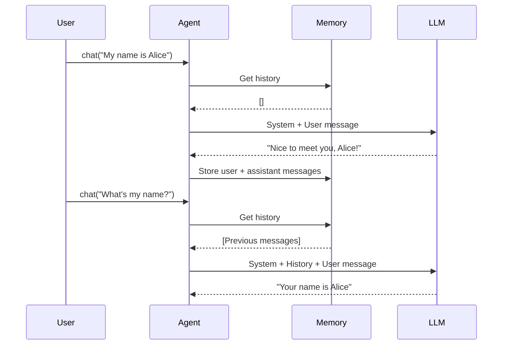

# PraisonAI Memory System

> Conversation memory and history management in PraisonAI

Memory stores conversation history, enabling agents to maintain context across interactions.

## Architecture

```
┌─────────────────────────────────────────────────────────────┐
│                      Agent                                   │
│  ┌─────────────────────────────────────────────────────┐    │
│  │                    Memory                            │    │
│  │  ┌─────────────────┐    ┌─────────────────────────┐ │    │
│  │  │  Short-Term     │    │   Long-Term (Optional)  │ │    │
│  │  │  (Rolling Buffer) │    │   (Vector Search)      │ │    │
│  │  └─────────────────┘    └─────────────────────────┘ │    │
│  └─────────────────────────────────────────────────────┘    │
└─────────────────────────────────────────────────────────────┘
```

## Quick Start

### Python

```python
from praisonaiagents import Agent

# Enable agent memory
agent = Agent(
    instructions="Remember our conversation",
    memory=True  # Enable memory
)

# Conversation context persists between calls
agent.chat("My name is Alice")
response = agent.chat("What's my name?")
# response: "Your name is Alice"
```

### JavaScript

```javascript
import { Agent } from "praisonai";

const agent = new Agent({
    instructions: "Remember our conversation",
    memory: true  // Enable memory
});

// Conversation context persists between calls
await agent.chat("My name is Alice");
const response = await agent.chat("What's my name?");
// response: "Your name is Alice"
```

## Memory Types

### Short-Term Memory (STM)

Rolling buffer that maintains recent conversation context.

- Auto-evicts oldest messages when limit reached
- System messages are preserved during trimming
- Default: 100 messages

```python
# Configure max messages
agent = Agent(
    instructions="You are a helpful assistant",
    memory=True,
    max_messages=50  # Custom limit
)
```

### Long-Term Memory (LTM)

Persistent semantic storage for cross-session context.

```python
# Enable LTM with vector storage
agent = Agent(
    instructions="You are a helpful assistant",
    memory="vector",  # Enable semantic search
    max_messages=100
)
```

## Memory Configuration

| Option | Type | Default | Description |
|--------|------|---------|-------------|
| `memory` | `bool` or `str` | `False` | Enable memory (`True` or `"vector"`) |
| `max_messages` | `int` | `100` | Max messages to retain |
| `session_id` | `str` | `"default"` | Session identifier |

## Session-Based Memory

Each conversation can have its own persistent memory:

```python
from praisonaiagents import Agent

# User-specific sessions
def handle_user(user_id, message):
    session = Session.load(user_id) or Session.new(user_id)
    
    agent = Agent(
        name="Assistant",
        session=session,  # Use session
        memory=True
    )
    
    return agent.chat(message)
```

## Memory Methods

| Method | Description |
|--------|-------------|
| `agent.chat(message)` | Send message (auto-stores history) |
| `agent.clear_memory()` | Clear all stored messages |
| `agent.get_history()` | Get conversation history |
| `agent.search_history(query)` | Search past messages |

## Backend Options

| Backend | Config Value | Description |
|---------|--------------|-------------|
| In-Memory | `True` or `"memory"` | Simple dict storage |
| Vector/Embeddings | `"vector"` or `"chromadb"` | Semantic search |
| SQLite | `"sqlite"` | File-based persistence |
| Redis | `"redis"` | Distributed memory |
| PostgreSQL | `"postgres"` | Server-based storage |
| Mem0 | `"mem0"` | Managed memory service |
| MongoDB | `"mongodb"` | Document storage |

```python
# Vector search with ChromaDB
agent = Agent(
    instructions="You are a helpful assistant",
    memory="chromadb"
)

# SQLite for file-based persistence
agent = Agent(
    instructions="You are a helpful assistant", 
    memory="sqlite"
)
```

## Best Practices

### 1. Set Appropriate max_messages

Too many messages increase token usage and cost.

```python
# Start with 50-100 for most use cases
agent = Agent(
    memory=True,
    max_messages=75
)
```

### 2. Clear Memory for New Contexts

```python
# Start a new topic - clear previous context
agent.clear_memory()
agent.chat("Let's talk about something completely different")
```

### 3. Use Search for Long Histories

```python
# Find relevant past messages instead of loading everything
results = agent.search_history("project deadline")
```

### 4. System Messages Preserved

The trimming algorithm keeps system messages - only user/assistant messages are removed when exceeding limits.

## Custom Memory Adapter

### Python

```python
from praisonaiagents import Agent, MemoryAdapter

class RedisMemory:
    def __init__(self, client):
        self.client = client
    
    async def store(self, message):
        # Store to Redis
        await self.client.lpush("memory", json.dumps(message))
    
    async def get_history(self):
        # Get from Redis
        messages = await self.client.lrange("memory", 0, -1)
        return [json.loads(m) for m in messages]

# Use custom adapter
agent = Agent(
    instructions="You are a helpful assistant",
    memory=RedisMemory(redis_client)
)
```

### JavaScript

```javascript
import { Agent, MemoryAdapter } from "praisonai";

class RedisMemory extends MemoryAdapter {
    async store(message) {
        await this.client.lpush("memory", JSON.stringify(message));
    }
    
    async getHistory() {
        const messages = await this.client.lrange("memory", 0, -1);
        return messages.map(m => JSON.parse(m));
    }
}

// Use custom adapter
const agent = new Agent({
    instructions: "You are a helpful assistant",
    memory: new RedisMemory(redisClient)
});
```

## Memory Flow



## Related

- [Sessions Documentation](./sessions.md) - Persistent conversation history
- [Agent Documentation](./agent.md) - Agent configuration